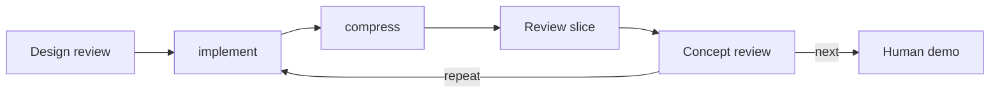

# Concept review: loops as backward edges

Working review, 2026-09-25. Product simplifications are valuable on their own;
follow their effects through the implementation to capture further wins.
The skill and its placement after review-slice are implemented locally. The
runtime/API details below are proposals for discussion. The User subsequently
clarified the branch objective: a loopflow is a Flow with one or more backward
edges, accepted everywhere a Flow is accepted. [The usage-first redesign](loopflow.md)
is the current target; the Task-only implementation is not an acceptable endpoint.

## The experience

The User knows what a Flow is but cannot readily tell which loop is "the loop."
A slice can be one stage of repeated work. They should be able to read one Flow,
see where another pass returns, and understand what Advance or Iterate will do.
They should not have to learn a separate Task phase sequence or review lifecycle.

## Usage draft before implementation design

The actual authoring guide now explains the current loop as a backward edge and
walks through the four-step body. The skill catalog starts concept-review with
rewriting intended usage. These edits describe the implemented local Flow.

Proposed documentation for the unresolved delivery interaction:

> At demo, Advance accepts the result and continues to the next Flow step.
> Iterate sends your revision direction back to implementation, then runs
> compression and both reviews before returning to demo. You continue the same
> Flow; you do not choose or start a separate loop.

Proposed review-skill instruction:

> Explain which Flow step each decision reaches before asking the human to
> choose. At a delivery gate after repeated implementation, Iterate means revise
> the work, not review it again without first making the requested change.

These passages are drafts for docs/lf.md and the human review guidance. They are
not installed instructions or claims about today's Iterate implementation.
The next product decision is whether that is the desired interaction. The
candidate code changes below follow from it.

Flow names the whole authored sequence. A loop is the path created by a backward
edge in it. One pass traverses that path. Slice names a bounded unit of work;
review names a judgment. "Loop" need not identify another running thing.

## What the implementation already proves

- `engine/flow.rs::RepeatPolicy { from, max_iterations }` is already a backward
  edge attached to one skill occurrence. Flow expansion validates the target is
  earlier and the body is autonomous, with no nested repeat or operations.
- `durable.rs::FlowPosition` pins one invocation and cursor. The driver follows
  its saved position through fresh Runs; there is no separate Loop executor.
- `LoopReview` persists the deciding node, prior pass count/direction, and a
  pending verdict. This is progress across steps, not just a review.
- `ReviewDecision::Continue` takes the backward edge. Complete moves forward;
  the rest of the Flow still runs. The new local pursue definition runs concept
  review after slice review and only then decides which edge to take.
- Human Iterate currently chooses the nearest preceding autonomous skill. At
  demo this is now concept-review, formerly review-slice. It does not directly
  return to implementation. The generic rule is documented, but a request to
  revise the work takes an indirect path.

These are source observations. The focused controller/store fixture proves two
four-step passes, direction carryover, unique Runs, and saved-verdict recovery
with simulated provider and Linear transport. It does not establish a live
human handoff or any proposed behavior below.

## Candidate simplifications

| Product change | Data/API consequence | Further infrastructure effect |
|---|---|---|
| Explain a decision as Next, Repeat, or Blocked | Step disposition can describe the selected edge instead of review-specific Continue/Complete | One transition reducer can return its outcome directly instead of bool plus inferred cursor changes |
| Show the repeated section and current pass in the Flow | Rename LoopReview to repeat progress; the stored node identifies its backward edge | Reuse the existing position and JSON storage; no Loop table, scheduler, or separate lifecycle |
| Iterate at delivery means revise the work | Resolve the preceding repeat edge's target rather than rerunning its deciding review | Reuse authored topology rather than adding another retry target or special demo Flow |
| Advance accepts a review and reports where the Flow is now | One optional approval value and the existing execution snapshot | Share output and driver launch plumbing across Task and Session commands |

The first product win is a readable path and predictable controls, even if no
code disappears. Only carry through infrastructure reductions that preserve
the guarantees below. Keep the Flow representation and ordinary entry points.
Do not introduce a separate loopflow runner; reconcile the generic Flow engine
and Task execution so both interpret the same edges and decision protocols.

`from` currently names the beginning of the repeated body. Under an edge-based
explanation, `to` or `back_to` would name the destination more directly. This is
an authoring choice to evaluate, not a reason to change persisted definitions
without migration. Likewise, transition names need not immediately rename the
public verdict command; existing pinned invocations can contain old instructions.

## Counterexamples and constraints

- "Next" at concept review must still mean the whole approved Task has adequate
  evidence. A clearer transition name cannot weaken the completion criterion.
- Human approval is an exact authorized decision. Autonomous verdicts and human
  decisions may select similar transitions but must retain distinct authority.
- A saved verdict must survive driver death and settle once without rerunning a
  model. It cannot be replaced by an in-memory return value.
- A worker retry is not another loop pass. Neither is human revision necessarily
  the same counter as repeat budget. Invocation identity, cursor version, worker
  generation, and the human Session iteration currently fence different races.
- Multiple sequential repeat sections need their own progress, so the global
  iteration cannot simply replace the active edge's pass count.
- Human gates and nested repeats are excluded from repeat bodies by the current
  implementation. Whether to retain those restrictions needs to follow the
  intended loopflow usage, including budget, reachability, and approval rules.

## First decision and smallest next proof

Decide the delivery interaction: should Iterate at the human demo directly
repeat implementation → compression → both reviews? The proposed answer is yes.
This changes the experience immediately and needs no new loop entity.

If accepted, the smallest proof starts at demo after a completed pass, records
an exact Iterate decision with revision direction, and observes implementation
as the next step. It must retain design-review Iterate, stale-decision rejection,
direction carryover, bounded repeat behavior, and fresh Run identities.

This delivery interaction is one case of the broader accepted loopflow goal,
not a sufficient fix on its own. The usage-first redesign now takes precedence
over a Task-local repair. No runtime redesign was performed during this review.
